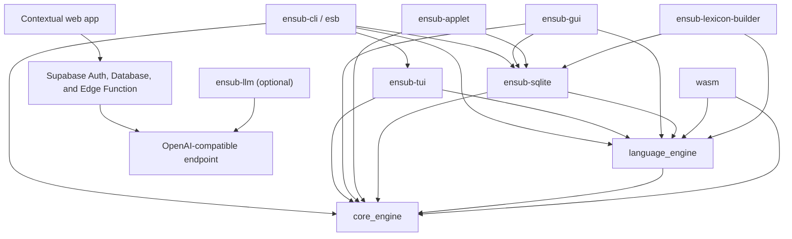

# Architecture

Ensub is organized as portable policy and contracts surrounded by platform
adapters and presentation surfaces. The dependency direction is inward:
domain crates do not import UI or persistence implementations.



## Workspace Components

| Path | Cargo package | Responsibility |
|---|---|---|
| `crates/core_engine` | `core_engine` | Owned domain records, SM-2 scheduling, native-agnostic storage contracts, and library/history read models |
| `crates/language_engine` | `language_engine` | Sentence and word segmentation, morphology, capture construction, lexicon contracts, browser lexicon, and optional document parsing |
| `crates/llm_client` | `ensub-llm` | Optional client for contextual disambiguation through OpenAI-compatible endpoints |
| `crates/sqlite_storage` | `ensub-sqlite` | SQLite implementation, migrations, standard paths, and native bundled lexicon extraction |
| `crates/cli` | `ensub-cli` | `clap` arguments, terminal prompts, command orchestration, and the `esb` binary |
| `crates/tui` | `ensub-tui` | Ratatui reader/review model, event loop, effects, terminal safety, and rendering |
| `crates/cosmic_gui` | `ensub-gui` | COSMIC application state, native effects, GUI reader, library, dashboard, capture HUD, and review views |
| `crates/cosmic_applet` | `ensub-applet` | COSMIC panel badge, popover review state, and capture-HUD launcher |
| `crates/wasm_bridge` | `ensub-wasm` | Browser DTOs, WASM bindings, versioned snapshot adapter, and `localStorage` backend |
| `crates/web_site` | none | Static HTML/CSS/JavaScript contextual assistant using anonymous Supabase sessions and an authenticated LLM Edge Function |
| `tools/lexicon_builder` | `ensub-lexicon-builder` | Reproducible native and browser lexicon artifact generation |
| `packaging` | none | COSMIC desktop entries, AppStream metadata, icons, and installation script |

All Cargo members use Rust edition 2021. The workspace pins one dependency
version for shared libraries and uses resolver version 2.

## Core Domain Boundary

`core_engine` owns the contracts that every surface must share:

- typed word and context identifiers;
- word, context, capture, review-state, and review-card records;
- validated recall ratings from 0 through 5;
- deterministic SM-2 interval and ease-factor functions;
- statistics, library pagination, review history, and activity read models;
- `StorageAdapter` and `LibraryStorageAdapter`.

Scheduling accepts the review timestamp as an argument and never reads a
system clock. It is therefore deterministic and portable across native tests,
desktop applications, and WebAssembly.

`core_engine` deliberately has no dependency on SQLite, `libcosmic`, terminal
libraries, WASM bindings, platform directories, or an async runtime.

## Language Boundary

`language_engine` keeps the parsing pipeline portable:

```text
input text
  -> sentence and word spans
  -> normalized morphology candidates
  -> Lexicon lookup
  -> ranked dictionary-backed candidates
  -> Capture records with deterministic IDs
```

The `Lexicon` trait separates lookup behavior from its storage format. Native
surfaces use the extracted read-only SQLite lexicon. The web surface decodes a
compressed Postcard browser asset. Both expose the same lemma, pronunciation,
part-of-speech, and definition model.

The optional `document` feature adds Markdown/plain-text blocks, inline style
ranges, and word tokens for the TUI and GUI readers without coupling the
language crate to either toolkit.

`ensub-llm` is a separate, provider-neutral network adapter. No current
application surface depends on it, so the bundled lexicon remains the default
and the existing capture flows do not require network access.

## Storage Ports and Adapters

`StorageAdapter` defines idempotent record upserts, atomic capture writes,
optimistic review transitions, due queries, counts, and statistics.
`LibraryStorageAdapter` adds search/sort pagination, immutable review history,
and activity aggregates for richer surfaces.

### Native SQLite

`SqliteStorage` automatically:

- creates parent directories and migrates the schema on open;
- enables foreign keys;
- selects WAL journal mode and `NORMAL` synchronous mode;
- configures a five-second busy timeout;
- uses immediate transactions for atomic multi-record captures and reviews;
- compare-and-swaps review states to avoid silently losing concurrent updates.

The schema contains `words`, `contexts`, `review_state`, and immutable
`review_events`. CLI, TUI, GUI, and applet use the same default database path.

### Browser Snapshot

`SnapshotStorage` implements the same storage behavior over a versioned JSON
snapshot. On `wasm32`, `LocalStorageBackend` persists it under
`ensub.sandbox.v1`. The site separately persists its deterministic sandbox
clock and coordinates writers between tabs with a browser lock or lease.

Browser snapshot storage is not connected to native SQLite and has no
synchronization or remote backend.

## Presentation Architecture

The TUI, GUI, and applet use explicit model-update-effect boundaries:

```text
platform event -> message -> pure state update -> effect description
                                            -> platform host performs I/O
                                            -> completion message
```

Storage and lexicon calls stay in the host/effect layer. Reducer tests can
therefore cover navigation, review phases, stale completion handling, and
capture transitions without opening a terminal, GUI compositor, or database.

The TUI additionally owns terminal setup and restoration, including a panic
hook that leaves raw mode and the alternate screen. The GUI disables
libcosmic's independent keyboard navigation and routes global and Reader
shortcuts through one subscription so page state and widget focus remain
synchronized.

## Dependency Rules

When adding functionality:

1. Put portable domain records and scheduling policy in `core_engine`.
2. Put portable parsing, morphology, lexicon, and document logic in
   `language_engine`.
3. Implement database- or browser-specific persistence outside both crates.
4. Keep UI state and effects in the owning presentation crate.
5. Pass timestamps into domain functions instead of reading the clock there.
6. Do not introduce native SQLite or UI dependencies into the WASM graph.

Use `cargo tree -p core_engine`, `cargo tree -p language_engine`, and
`cargo tree -p ensub-wasm --target wasm32-unknown-unknown` to inspect these
boundaries.
