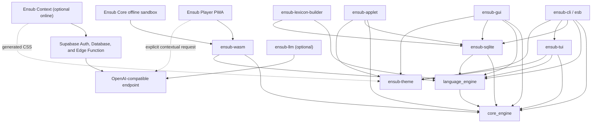

# Architecture

Ensub is organized as portable policy and contracts surrounded by platform
adapters and presentation surfaces. The dependency direction is inward:
domain crates do not import UI or persistence implementations.

The PWA/Web Player is feature complete and frozen at v0.2.0 as a reference
prototype; native Android is the active client track. See
[Platform Status](platform-status.md) for the lifecycle and regression policy.



## Workspace Components

| Path | Cargo package | Responsibility |
|---|---|---|
| `crates/core_engine` | `core_engine` | Owned domain records, SM-2 scheduling, native-agnostic storage contracts, and library/history read models |
| `crates/language_engine` | `language_engine` | Portable podcast feed, transcript, sentence, word, morphology, lexicon, capture, and optional document parsing |
| `crates/llm_client` | `ensub-llm` | Optional client for contextual disambiguation through OpenAI-compatible endpoints |
| `crates/theme` | `ensub-theme` | Dependency-free semantic RGB roles, Catppuccin Mocha Mauve default, and deterministic CSS export |
| `crates/sqlite_storage` | `ensub-sqlite` | SQLite implementation, migrations, standard paths, and native bundled lexicon extraction |
| `crates/cli` | `ensub-cli` | `clap` arguments, terminal prompts, command orchestration, and the `esb` binary |
| `crates/tui` | `ensub-tui` | Ratatui reader/review model, event loop, effects, terminal safety, and rendering |
| `crates/cosmic_gui` | `ensub-gui` | COSMIC application state, native effects, GUI reader, library, dashboard, capture HUD, and review views |
| `crates/cosmic_applet` | `ensub-applet` | COSMIC panel badge, popover review state, and capture-HUD launcher |
| `crates/wasm_bridge` | `ensub-wasm` | Frozen v0.2.0 browser adapter: DTOs, standalone ingestion bindings, versioned snapshot adapter, and `localStorage` backend; maintenance and regression only |
| `crates/web_player` | none | Frozen v0.2.0 reference PWA: installable audio workspace, synchronized transcript DOM, IndexedDB player cache, and Web Locks coordination; no new client features |
| `crates/web_sandbox` | none | Offline static Ensub Core reference harness, bundled WASM/lexicon assets, Web Locks coordination, and service worker |
| `crates/web_site` | none | Separate optional Ensub Context assistant using anonymous Supabase sessions and an authenticated LLM Edge Function |
| `tools/lexicon_builder` | `ensub-lexicon-builder` | Reproducible native and browser lexicon artifact generation |
| `packaging` | none | COSMIC desktop entries, AppStream metadata, icons, and installation script |

All Cargo members use Rust edition 2021. The workspace pins one dependency
version for shared libraries and uses resolver version 2.

## Core Domain Boundary

`core_engine` owns the contracts that every surface must share:

- typed word and context identifiers;
- word, context, capture, review-state, and review-card records;
- validated recall ratings from 0 through 5;
- deterministic SM-2 interval and ease-factor functions;
- statistics, library pagination, review history, and activity read models;
- `StorageAdapter` and `LibraryStorageAdapter`.

Scheduling accepts the review timestamp as an argument and never reads a
system clock. It is therefore deterministic and portable across native tests,
desktop applications, and WebAssembly.

`core_engine` deliberately has no dependency on SQLite, `libcosmic`, terminal
libraries, WASM bindings, platform directories, or an async runtime.

## Language Boundary

`language_engine` keeps the parsing pipeline portable:

```text
input text
  -> sentence and word spans
  -> normalized morphology candidates
  -> Lexicon lookup
  -> ranked dictionary-backed candidates
  -> Capture records with deterministic IDs
```

The `Lexicon` trait separates lookup behavior from its storage format. Native
surfaces use the extracted read-only SQLite lexicon. The web surface decodes a
compressed Postcard browser asset. Both expose the same lemma, pronunciation,
part-of-speech, and definition model.

The optional `document` feature adds Markdown/plain-text blocks, inline style
ranges, and word tokens for the TUI and GUI readers without coupling the
language crate to either toolkit.

Portable podcast ingestion follows the same inward dependency direction:

```text
RSS 2.0 / Atom 1.0 bytes
  -> language_engine namespace-aware parser
  -> PodcastFeed + valid PodcastEpisode records + typed item issues

WebVTT / SRT text + TranscriptResource
  -> language_engine caption parser and tokenizer
  -> validated TranscriptDocument with source-ordered cues

schema-v1 podcast fixture JSON + source URL
  -> language_engine strict fixture parser and tokenizer
  -> validated feed + episode + embedded TranscriptDocument
```

`core_engine` owns these media DTOs and their cross-platform invariants.
`language_engine` owns raw-input parsing, URL normalization, format-specific
timestamp handling, and stable typed parse errors. Fatal feed errors reject the
document; invalid feed entries or metadata are reported as item issues with an
explicit disposition. Transcript parsing rejects missing or invalid timestamps,
invalid cue bounds, and decreasing cue start times without reordering input.

`ensub-wasm` exposes `parsePodcastFeed` and `parseTranscript` as standalone
browser functions. They convert Rust DTOs to camel-case browser DTOs, publication
times to epoch milliseconds, and UTF-8 token byte spans to UTF-16 offsets. These
functions are independent of `EnsubSandbox` and do not read or mutate snapshot
storage.

The same WASM package exposes `EnsubPlayerWorkspace`. Rust owns episode identity
reconciliation, the versioned `ensub-player-cache` envelope, feed/transcript
parsing, cache validation, fixture validation and import, active-cue selection,
and next/previous cue navigation. The zero-feed demo path fetches the bounded
`assets/demo-fixture.json` bytes and passes them unchanged to
`importDemoFixture`; Rust requires an empty workspace, resolves its relative
HTTP(S) resources, validates the feed, episode, and embedded WebVTT cue data,
then atomically installs the feed, episode, and transcript. A rejected fixture
does not mutate the live workspace or serialized cache.

The PWA is a thin host. It renders the player workspace directly, owns bounded
HTTP transport, one DOM audio element, animation-frame scheduling, transcript
highlight classes, scrolling, focus, and IndexedDB/Web Locks effects. DOM
`timeupdate` and `seeked` media times are converted to integer milliseconds and
passed directly to Rust `syncAt`; animation frames provide additional updates
while audio plays. Rust returns every active cue plus an anchor, including
overlapping cues, while JavaScript applies the visual and ARIA state, follows
the anchor smoothly, suspends following after manual scrolling, and seeks the
audio element when a cue is chosen. The player envelope is deliberately
separate from the learning snapshot so its schema can evolve independently
from learning-storage migrations. IndexedDB operations resolve on transaction
completion rather than request success; an abort therefore leaves both
persisted bytes and the live workspace unchanged.

The static build generates a content-addressed service worker after all output
files are assembled. Its precache includes the application shell, WASM package,
the `assets/lexicon-v1.manifest.json` and
`assets/lexicon-v1.postcard.gz` sidecars, and the demo fixture and two-minute
MP3. Registration begins before WASM boot, so these local assets can be
installed even while the runtime initializes.

M5.4 adds `preparePodcastCapture` to that workspace and a separate
`EnsubPlayerLearning` facade. Rust revalidates the workspace revision, episode,
transcript, cue, and token; reconstructs sentence context across at most three
adjacent cues and 60 lexical tokens in either direction (falling back to the
bounded cue window when no complete boundary is found);
performs the offline lexicon lookup; and constructs the provenance and logical
audio slice. JavaScript only maps Rust UTF-16 spans into DOM nodes, supplies
host media times, renders states, and coordinates explicit capture effects.

M5.5 extends the portable boundary without moving platform effects into Rust.
`core_engine` defines ordered due-card queries and review queue records while
retaining the single SM-2 transition implementation and caller-supplied
timestamps. `language_engine` serializes candidate senses and the minimal
context request, owns the static JSON-schema system prompt, and validates the
provider response. `ensub-wasm` exposes prompt cards containing only the
captured headword, context-specific selected surface, saved context, and audio
descriptor; separate reveal DTOs expose lexical answers. It also exposes rating
transitions and disambiguation preparation/validation.

The PWA owns both effectful loops. Its review reducer follows
`open -> prompt -> revealing -> rated -> reloading -> complete -> exit`; session
IDs reject late effects. A canonical `ReviewState` content hash is the
deterministic review token, and the final storage mutation is a compare-and-swap.
The audio host pushes episode ID, millisecond position, and playback rate onto a
session stack, locks ordinary transport, suppresses player sync during snippet
mode, and combines `timeupdate` with animation frames. Exit restores the episode
and leaves it paused. Every terminal `pause`, `abort`, `ended`, or `error` event
synchronously cancels the frame and removes all boundary listeners before
settling. Review entry aborts contextual provider work, closes and clears lookup
state, and renders on an opaque surface above the transcript.

The provider adapter is replaceable host JavaScript. It owns HTTP, timeout,
credential headers, response-size limits, and consent storage; it does not enter
the WASM dependency graph. The default OpenAI-compatible request includes
`response_format: { "type": "json_object" }`. It plans one serialized body used
unchanged by both the consent preview and `fetch`; the credential is disclosed
only as a redacted authorization header. Calls exist only behind the lookup
panel's explicit action, and AI results remain separate from local lexicon and
capture state.

`ensub-llm` is a separate, provider-neutral network adapter. No current
application surface depends on it, so the bundled lexicon remains the default
and the existing capture flows do not require network access.

## Storage Ports and Adapters

`StorageAdapter` defines idempotent record upserts, atomic capture writes,
optimistic review transitions, due queries, counts, and statistics.
`LibraryStorageAdapter` adds search/sort pagination, immutable review history,
and activity aggregates for richer surfaces.

### Native SQLite

`SqliteStorage` automatically:

- creates parent directories and migrates the schema on open;
- enables foreign keys;
- selects WAL journal mode and `NORMAL` synchronous mode;
- configures a five-second busy timeout;
- uses immediate transactions for atomic multi-record captures and reviews;
- compare-and-swaps review states to avoid silently losing concurrent updates.

The schema contains `words`, `contexts`, `review_state`, and immutable
`review_events`. CLI, TUI, GUI, and applet use the same default database path.

### Browser Snapshot

`SnapshotStorage` implements the same storage behavior over a versioned JSON
snapshot. On `wasm32`, `LocalStorageBackend` persists it under
`ensub.sandbox.v1`. The Ensub Core sandbox uses `Date.now()` for operation
timestamps and takes a short-lived exclusive Web Lock around each mutation.
Browsers without Web Locks open the WASM adapter read-only.

Schema v2 adds `podcastContexts`, keyed by the generic context ID. At startup,
under the existing exclusive learning-storage lock, a valid v1 snapshot is
copied byte-for-byte to the immutable `ensub_v0.1_backup` key before one
complete v2 snapshot is installed with an incremented revision. An identical
backup permits a safe retry; a conflicting backup, corrupt input, or failed
write aborts migration and latches that runtime read-only. The host then offers
an exact raw JSON export while lookup and readable queries remain available.
`PodcastStorageAdapter` atomically
stores the word, generic sentence, structured media context, and initial SM-2
state. Word identity is deterministic by normalized lemma, while encounter
identity includes episode, transcript, cue, and token span.

Browser snapshot storage is not connected to native SQLite and has no
synchronization or remote backend. The WASM graph has no dependency on Ensub
Context, Supabase, `ensub-llm`, HTTP clients, native SQLite, or native UI crates.
The PWA's optional user-configured provider transport is a separate host
adapter; the static build scans for embedded high-confidence credentials.

The Player's local-data boundary exports the exact learning JSON text and the
opaque Player cache bytes in a versioned, base64-bearing document. It never
reads provider configuration into that export. Reset deletes only the Player
snapshot, learning snapshot, and Ensub provider configuration, credential, and
consent keys, leaving unrelated origin storage and service-worker caches intact.

## Presentation Architecture

`ensub-theme` defines semantic colors without depending on any UI toolkit. Its
`Theme` values are developer-configurable, and Catppuccin Mocha Mauve is the
only built-in preset and the default. TUI, dialoguer, COSMIC GUI, and COSMIC
applet adapters convert the RGB roles locally. The static web build runs the
theme exporter to generate `dist/theme.css`; generated CSS is not committed.
Typography, spacing, radii, shadows, and motion remain owned by each frontend.
Plain CLI output, Clap help styling, and WASM presentation APIs do not depend
on the theme crate.

The TUI, GUI, and applet use explicit model-update-effect boundaries:

```text
platform event -> message -> pure state update -> effect description
                                            -> platform host performs I/O
                                            -> completion message
```

Storage and lexicon calls stay in the host/effect layer. Reducer tests can
therefore cover navigation, review phases, stale completion handling, and
capture transitions without opening a terminal, GUI compositor, or database.

The TUI additionally owns terminal setup and restoration, including a panic
hook that leaves raw mode and the alternate screen. The GUI disables
libcosmic's independent keyboard navigation and routes global and Reader
shortcuts through one subscription so page state and widget focus remain
synchronized.

## Dependency Rules

When adding functionality:

1. Put portable domain records and scheduling policy in `core_engine`.
2. Put portable parsing, morphology, lexicon, and document logic in
   `language_engine`.
3. Implement database- or browser-specific persistence outside both crates.
4. Keep UI state and effects in the owning presentation crate.
5. Pass timestamps into domain functions instead of reading the clock there.
6. Do not introduce native SQLite or UI dependencies into the WASM graph.

Use `cargo tree -p core_engine`, `cargo tree -p language_engine`, and
`cargo tree -p ensub-wasm --target wasm32-unknown-unknown` to inspect these
boundaries.
